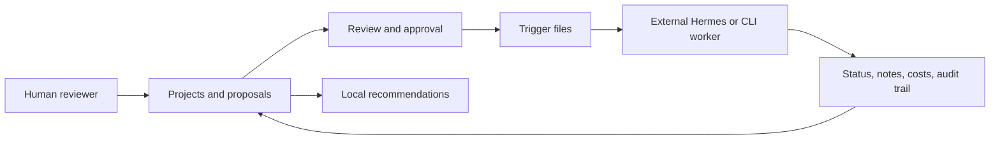

# Hermes Proposals Dashboard

<div align="center">

**A proposal-first control center for projects, human review, and externally executed AI work.**

[Open Dashboard](https://reidar.tech/proposals) | [Product Overview](ABOUT.md) | [Documentation](docs/wiki/Home.md) | [Getting Started](docs/wiki/Getting-Started.md)


</div>

Hermes Proposals Dashboard turns a stream of ideas and AI-assisted tasks into a reviewable operating system. Create projects, submit proposals, decide what should happen, route approved work to an external Hermes or CLI worker, and retain an audit trail of decisions, workflow state, and cost records.

The dashboard is intentionally honest about execution: it stores and reviews work locally, but it does **not** silently run agents or call paid LLM providers. Real execution begins only when a separately configured worker consumes its trigger integration.

## Why This Exists

AI-assisted work needs a human-facing control surface:

- Keep active initiatives visible as **Projects**, rather than losing work in chat histories.
- Capture candidate work as **Proposals** with outcomes, criteria, risk, assignment, and cost context.
- Surface the next useful action through local, explainable recommendations.
- Require human review for important decisions and risky executor routes.
- Let external workers execute accepted work while the dashboard remains the system of record.

## Product Tour

| Area | Purpose |
| --- | --- |
| **Projects** | List initiatives, group proposals, and show locally derived next-step recommendations. |
| **Proposals** | Inbox for new work, waiting items, active work, reviews, and completed outcomes. |
| **Reviews** | Approval decisions for proposals and workflow runs. |
| **Workflows** | Reusable staged processes with handoffs and run history. |
| **Settings** | Goals, agents, budgets, worker setup, and organization configuration. |
| **Demo walkthrough** | Removable sample proposal and review flow; no worker is executed. |

## First Five Minutes

```bash
git clone https://github.com/Reedtrullz/hermes-proposals-dashboard.git
cd hermes-proposals-dashboard
python3 -m venv .venv
.venv/bin/pip install -r requirements.txt
HERMES_REQUIRE_AUTH=0 .venv/bin/python -m uvicorn main:app --host 127.0.0.1 --port 8089 --reload
```

Open [http://127.0.0.1:8089/proposals](http://127.0.0.1:8089/proposals), then:

1. Select **Try demo** to explore a proposal that safely needs a decision.
2. Add a note, use **Approve** or **Request changes**, and remove the demo when done.
3. Open **Projects** and create an initiative with a desired outcome.
4. Submit a real proposal within that project. Its initial status is **Waiting for worker**.
5. Open the project page to see next-step recommendations calculated from recorded state.

The default database and trigger files live under `$HERMES_HOME`; without configuration this is `~/.hermes`.

## How It Works



### Recommendations Versus AI Execution

Project pages provide immediate recommendations such as resolving a pending decision or routing waiting work. These recommendations are deterministic and derived from SQLite state; they do not invoke a model.

For deeper AI-assisted planning, select **Ask worker for recommendations** on a project. That creates a real waiting proposal using the existing trigger mechanism. A configured external worker may then analyze the project and return its recommendations through the normal review process.

### Worker Trigger Contract

Creating a real proposal writes its identifier to:

```text
$HERMES_HOME/proposals_trigger
```

Approving a real proposal writes:

```text
APPROVED:<proposal_id>
```

When a proposal is assigned to a non-Hermes executor, routing metadata is also written to:

```text
$HERMES_HOME/proposals_trigger_executor
```

Demo proposals never write execution triggers.

## Core Capabilities

- Proposal inbox with `Waiting for worker`, active review, decision, and completed views.
- Project registry with desired outcomes, scoped proposals, costs, and recommended actions.
- Safe demo workflow for first-run exploration.
- Notes and review rendering that escapes untrusted markup.
- Human approval policy for risky or costly proposals and failed workflows.
- Agent records and seeded role templates, including CLI executor delegators.
- Workflow templates, staged runs, explicit handoffs, and audit history.
- Manual usage and budget records for agents, projects, proposals, workflows, and goals.
- SQLite persistence with idempotent migrations and JSON-compatible proposal APIs.
- Docker Compose and Ansible deployment paths for self-hosting.

## Executor Support

The dashboard can route proposals to native Hermes workers or to configured CLI delegates.

| Executor | Binary | Intended route |
| --- | --- | --- |
| Hermes | Native integration | External Hermes worker loop |
| Codex CLI | `codex` | `codex exec --full-auto` |
| Claude Code | `claude` | `claude -p` |
| OpenCode | `opencode` | `opencode run` |
| Antigravity | `agy` | `agy exec` |
| Command Code | `cmd` | `cmd -p` |
| Kilo Code | `kilo` | `kilo run --auto` |

The dashboard records routing information and safety approvals; the external worker owns spawning tools, reconciling output, and reporting completion. See [CLI Executor Reference](docs/cli-executor-reference.md).

## Routes At A Glance

| Surface | Route |
| --- | --- |
| Proposal inbox | `/proposals` |
| Project overview | `/proposals/projects` |
| Reviews | `/proposals/approvals` |
| Workflows | `/proposals/workflows` |
| Settings and worker guidance | `/proposals/settings` |
| Health endpoint | `/health` |
| JSON proposal API | `/api/proposals` |
| Executor routing API | `/api/proposals/{id}/executor` |

See [API and Integrations](docs/wiki/API-and-Integrations.md) for trigger formats and endpoint behavior.

## Self-Hosting

### Docker Compose

```bash
cp .env.example .env
# Set HERMES_API_KEY and AUTH_URL before exposing the service.
docker compose up -d --build
```

SQLite state and trigger files are persisted in the `hermes-data` volume mounted at `/data/hermes`.

### VPS Deployment

The included Ansible playbook deploys the GHCR image, persists `/data/hermes`, health-checks the application, and routes the dashboard through Caddy at:

```text
https://reidar.tech/proposals
```

```bash
ansible-playbook ansible-playbook.yml --syntax-check
ansible-playbook ansible-playbook.yml
```

Review [Deployment](docs/wiki/Deployment.md) before operating a hosted instance.

## Security Model

- Hosted deployments enable auth by default with `HERMES_REQUIRE_AUTH=1`.
- Browser access is delegated through Auth.js cookie state and `AUTH_URL`.
- API integrations may authenticate with `X-Hermes-Key: $HERMES_API_KEY`.
- Local development may set `HERMES_REQUIRE_AUTH=0`; do not expose that configuration publicly.
- The application stores operational information locally and does not hold LLM provider API keys.

Security reporting guidance is in [SECURITY.md](SECURITY.md).

## Development

After moving or renaming the repository directory, recreate `.venv`. Virtual environment console scripts embed absolute paths; running the module via `.venv/bin/python -m uvicorn` avoids a stale launcher path.

```bash
.venv/bin/python -m compileall -q main.py
.venv/bin/python -m pytest -q
docker build -t hermes-proposals-dashboard .
```

Tests isolate SQLite and trigger state under a temporary `HERMES_HOME`; never run tests against personal `~/.hermes` state.

## Documentation

| Guide | Read this when... |
| --- | --- |
| [About](ABOUT.md) | You want the product vision, principles, and scope. |
| [Getting Started](docs/wiki/Getting-Started.md) | You are opening the dashboard for the first time. |
| [Product Guide](docs/wiki/Product-Guide.md) | You need a tour of projects, proposals, reviews, and workflows. |
| [Projects and Recommendations](docs/wiki/Projects-and-Recommendations.md) | You want to organize initiatives or understand suggestions. |
| [Workers and Executors](docs/wiki/Workers-and-Executors.md) | You are wiring Hermes or CLI execution. |
| [Architecture](docs/wiki/Architecture.md) | You need storage, lifecycle, and component boundaries. |
| [API and Integrations](docs/wiki/API-and-Integrations.md) | You are building an external worker or API client. |
| [Deployment](docs/wiki/Deployment.md) | You are self-hosting or deploying to the VPS. |
| [Operations and Troubleshooting](docs/wiki/Operations-and-Troubleshooting.md) | A launch, auth, trigger, or status flow is unclear. |
| [FAQ](docs/wiki/FAQ.md) | You need a quick answer. |

The `docs/wiki/` directory is the maintained source for the project wiki so documentation changes can be reviewed with code changes.

## Contributing

Contributions should preserve the proposal-first language, API compatibility, and the external worker boundary. Read [CONTRIBUTING.md](CONTRIBUTING.md) before opening a pull request.
