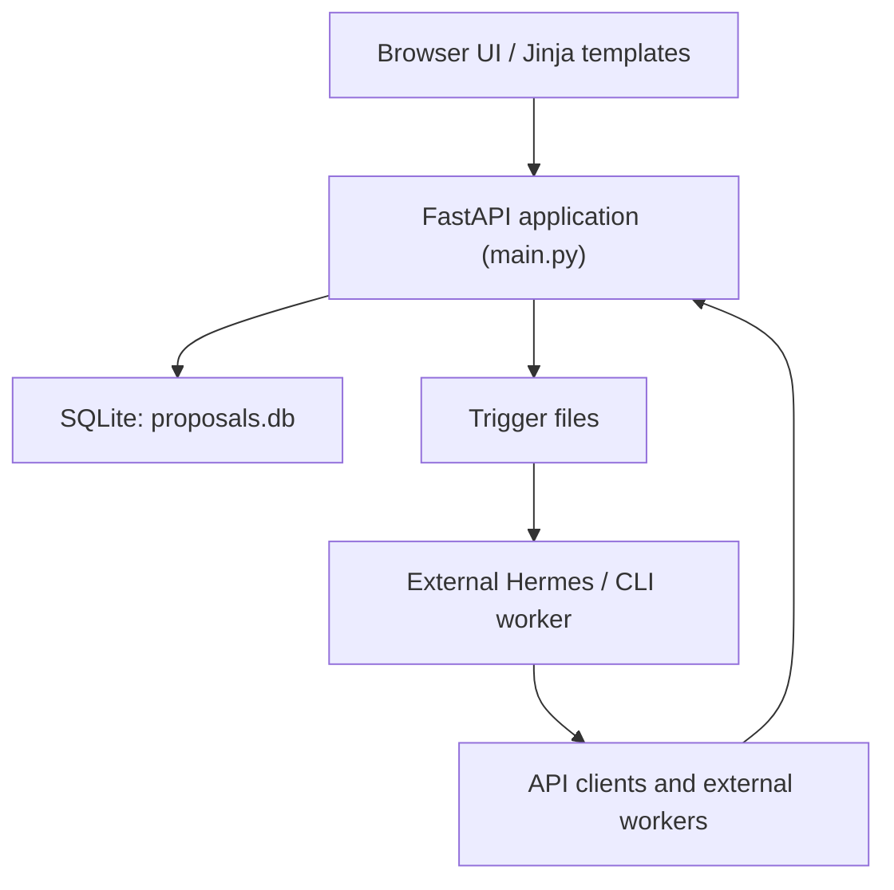
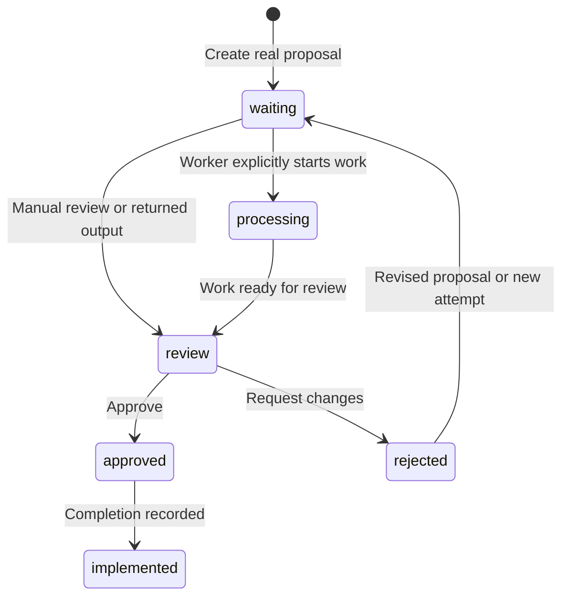

# Architecture

## System Shape

Hermes Proposals Dashboard is a small server-rendered application with an explicit integration boundary.

## Runtime Components

| Component | Responsibility |
| --- | --- |
| `main.py` | Application configuration, SQLite schema/migrations, seed records, route handlers, small query helpers, trigger writes. |
| `templates/` | Server-rendered product interface with no required frontend build pipeline. |
| `$HERMES_HOME/proposals.db` | Persistent local operational records. |
| `$HERMES_HOME/proposals_trigger` | Existing real-proposal and approval signal contract. |
| `$HERMES_HOME/proposals_trigger_executor` | Optional non-Hermes executor routing metadata. |
| External worker | Reads triggers, invokes execution backends, and reports results. |

## Data Model

Core records include:

| Record | Purpose |
| --- | --- |
| `projects` | Named initiatives, descriptions, desired outcomes, and lifecycle status. |
| `proposals` | Submitted work, status, project compatibility key, metadata, assignment, and demo marker. |
| `proposal_comments` | Human or worker review thread entries. |
| `agents` | Roles, executor route, model/provider labels, tools, hierarchy, budgets, and status. |
| `goals` | Higher-level outcomes and metrics linked to proposals. |
| `workflow_templates` and stages | Repeatable work definitions. |
| `workflow_runs` and run stages | Executed workflow state. |
| `agent_handoffs` | Explicit movement of context between agents. |
| `approval_requests` and policies | Pending and resolved decisions. |
| `usage_records` and `budgets` | Estimated/manual actual cost tracking. |
| `audit_events` | Append-only operation history. |

## Compatibility Decisions

- The established `/proposals` and `/api/proposals` paths remain stable.
- The existing proposal `board` field remains the compatibility key for project grouping and project budget scopes.
- Legacy API callers that set a non-default `board` produce a visible corresponding project.
- Existing trigger file names and formats are not repurposed.
- `processing` remains valid for workers that explicitly set active work, while newly submitted real work starts at `waiting`.

## Proposal Lifecycle

Pending approval requests produce a derived **Needs decision** presentation without creating another conflicting stored proposal status.

## Security Boundary

The dashboard accepts and displays operational content, but external worker privileges are outside the web process. Hosted deployments require authentication by default. The application escapes note markup before applying limited display formatting, preventing notes from becoming browser-executable HTML.
